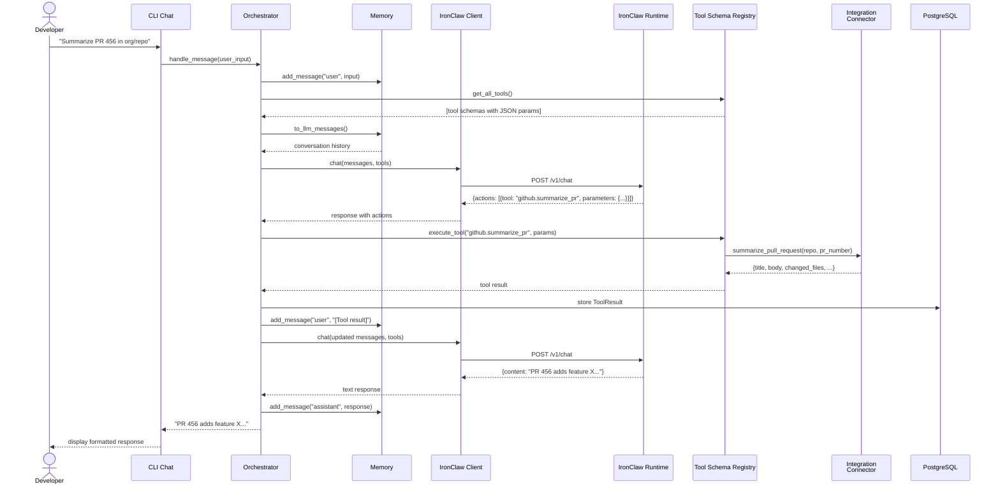
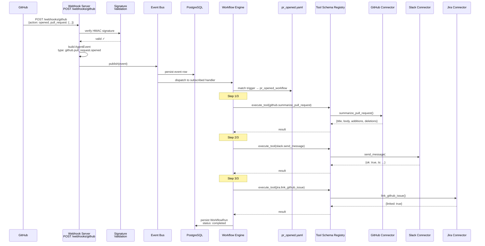
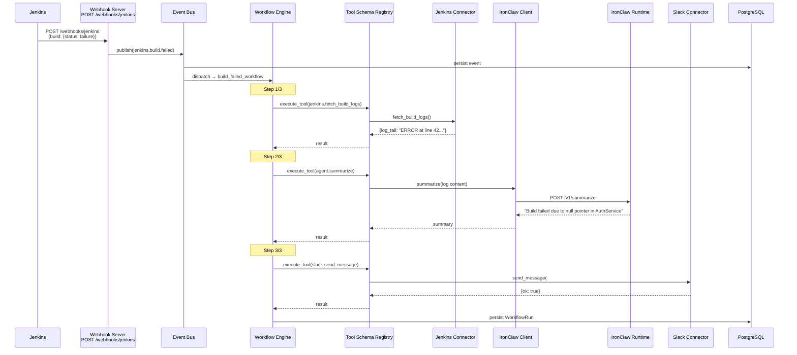
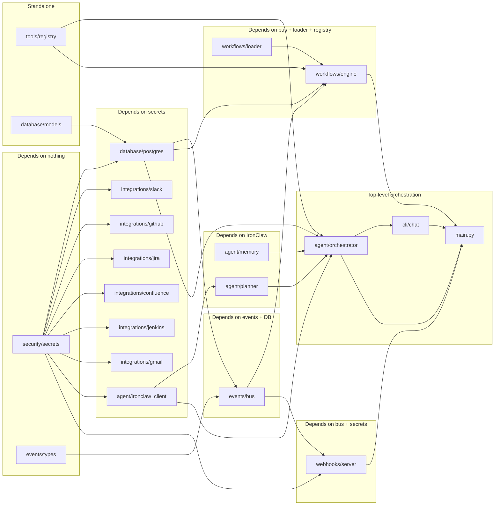

# Claw Agent — Architecture Diagrams

## System Architecture

```mermaid
graph TB
    subgraph External Services
        SLACK["Slack"]
        GITHUB["GitHub"]
        JIRA["Jira"]
        CONFLUENCE["Confluence"]
        JENKINS["Jenkins"]
        GMAIL["Gmail"]
    end

    subgraph IronClaw Runtime
        IC["IronClaw<br/>(Rust OpenClaw)"]
        LLM_API["LLM Provider"]
        IC -->|reasoning| LLM_API
    end

    subgraph Claw Agent
        subgraph Entry Points
            CLI["CLI Chat<br/><i>cli/chat.py</i>"]
            WEBHOOK["Webhook Server<br/><i>webhooks/server.py</i><br/>localhost:8080"]
        end

        subgraph Agent Core
            ORCH["Orchestrator<br/><i>agent/orchestrator.py</i>"]
            IC_CLIENT["IronClaw Client<br/><i>agent/ironclaw_client.py</i>"]
            PLANNER["Planner<br/><i>agent/planner.py</i>"]
            MEMORY["Conversation Memory<br/><i>agent/memory.py</i>"]
        end

        subgraph Tool Layer
            TOOL_REG["Tool Schema Registry<br/><i>tools/registry.py</i>"]
        end

        subgraph Event System
            BUS["Event Bus<br/><i>events/bus.py</i>"]
            TYPES["Event Types<br/><i>events/types.py</i>"]
        end

        subgraph Workflow System
            ENGINE["Workflow Engine<br/><i>workflows/engine.py</i>"]
            LOADER["YAML Loader<br/><i>workflows/loader.py</i>"]
            WF_YAML["Workflow Definitions<br/><i>*.yaml</i>"]
        end

        subgraph Integration Connectors
            I_SLACK["Slack Connector<br/><i>integrations/slack.py</i>"]
            I_GITHUB["GitHub Connector<br/><i>integrations/github_integration.py</i>"]
            I_JIRA["Jira Connector<br/><i>integrations/jira_integration.py</i>"]
            I_CONF["Confluence Connector<br/><i>integrations/confluence.py</i>"]
            I_JENKINS["Jenkins Connector<br/><i>integrations/jenkins.py</i>"]
            I_GMAIL["Gmail Connector<br/><i>integrations/gmail.py</i>"]
        end

        subgraph Infrastructure
            SECRETS["Secure Credentials<br/><i>security/secrets.py</i>"]
            DB["PostgreSQL<br/><i>database/postgres.py</i>"]
        end
    end

    %% User entry
    USER((Developer)) -->|natural language| CLI
    SLACK -->|webhooks| WEBHOOK
    GITHUB -->|webhooks| WEBHOOK
    JIRA -->|webhooks| WEBHOOK
    JENKINS -->|webhooks| WEBHOOK

    %% CLI to Orchestrator
    CLI --> ORCH
    ORCH --> MEMORY
    ORCH --> PLANNER
    ORCH --> IC_CLIENT
    ORCH --> TOOL_REG
    IC_CLIENT -->|HTTP/JSON| IC

    %% Webhook to Event Bus
    WEBHOOK --> BUS
    BUS --> ENGINE
    ENGINE --> LOADER
    LOADER --> WF_YAML

    %% Tool Registry to Connectors
    TOOL_REG --> I_SLACK
    TOOL_REG --> I_GITHUB
    TOOL_REG --> I_JIRA
    TOOL_REG --> I_CONF
    TOOL_REG --> I_JENKINS
    TOOL_REG --> I_GMAIL

    %% Connectors to External
    I_SLACK --> SLACK
    I_GITHUB --> GITHUB
    I_JIRA --> JIRA
    I_CONF --> CONFLUENCE
    I_JENKINS --> JENKINS
    I_GMAIL --> GMAIL

    %% Infrastructure
    SECRETS -.->|credentials| I_SLACK
    SECRETS -.->|credentials| I_GITHUB
    SECRETS -.->|credentials| I_JIRA
    SECRETS -.->|credentials| I_CONF
    SECRETS -.->|credentials| I_JENKINS
    SECRETS -.->|credentials| I_GMAIL
    SECRETS -.->|api key| IC_CLIENT
    BUS -->|persist events| DB
    ENGINE -->|persist runs| DB
    ORCH -->|persist tool results| DB
    MEMORY -.->|persist memory| DB

    %% Styling
    classDef external fill:#e8f4fd,stroke:#2196F3,stroke-width:2px
    classDef ironclaw fill:#fff9c4,stroke:#FFC107,stroke-width:2px
    classDef entry fill:#fff3e0,stroke:#FF9800,stroke-width:2px
    classDef core fill:#e8f5e9,stroke:#4CAF50,stroke-width:2px
    classDef tool fill:#e3f2fd,stroke:#1976D2,stroke-width:2px
    classDef event fill:#f3e5f5,stroke:#9C27B0,stroke-width:2px
    classDef workflow fill:#fce4ec,stroke:#E91E63,stroke-width:2px
    classDef connector fill:#e0f2f1,stroke:#009688,stroke-width:2px
    classDef infra fill:#f5f5f5,stroke:#607D8B,stroke-width:2px

    class SLACK,GITHUB,JIRA,CONFLUENCE,JENKINS,GMAIL external
    class IC,LLM_API ironclaw
    class CLI,WEBHOOK entry
    class ORCH,IC_CLIENT,PLANNER,MEMORY core
    class TOOL_REG tool
    class BUS,TYPES event
    class ENGINE,LOADER,WF_YAML workflow
    class I_SLACK,I_GITHUB,I_JIRA,I_CONF,I_JENKINS,I_GMAIL connector
    class SECRETS,DB infra
```

## Data Flow — Chat Request via IronClaw

## Data Flow — Webhook Event (PR Opened)

## Data Flow — Build Failed Workflow

## Component Dependency Map

